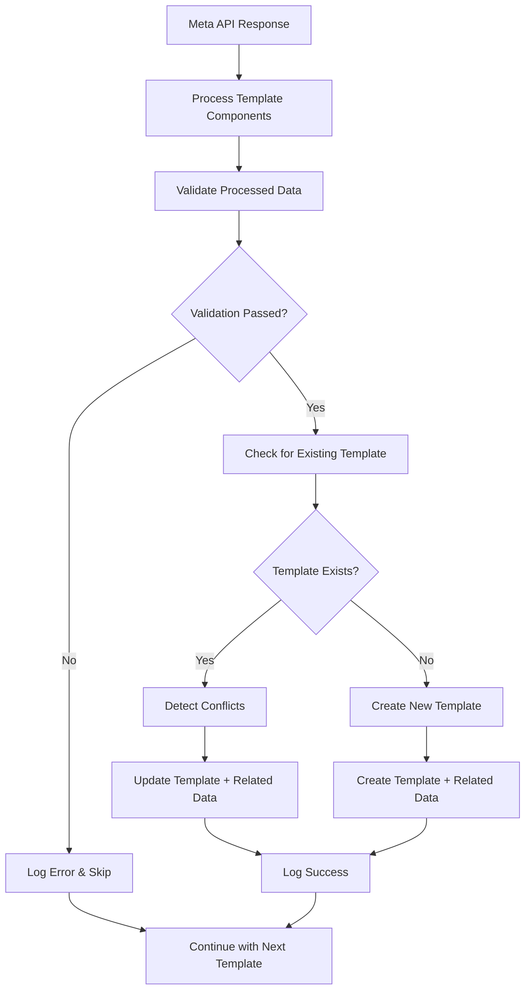

# Enhanced Template Syncing System ✅

## Overview

The enhanced template syncing system provides comprehensive processing and storage of WhatsApp templates including rich media components, interactive elements, and detailed metadata. This system ensures reliable template synchronization between Meta WhatsApp API and the ERP database with robust error handling and conflict resolution.

## ✨ Key Features

### 1. **Rich Media Component Processing**
- **Header Components**: TEXT, IMAGE, VIDEO, DOCUMENT headers with proper metadata extraction
- **Footer Components**: Footer text content preservation
- **Interactive Elements**: Buttons (QUICK_REPLY, URL, PHONE_NUMBER) with full configuration
- **Media Attachments**: Comprehensive media file tracking with metadata

### 2. **Comprehensive Validation**
- Template body and variable validation
- Header type and media URL validation
- Button configuration validation (type, text, URLs, phone numbers)
- Variable count consistency checks
- WhatsApp API compliance validation

### 3. **Advanced Error Handling**
- Structured error categorization (VALIDATION_ERROR, TIMEOUT_ERROR, etc.)
- Detailed error reporting with suggested actions
- Database error logging for analytics and debugging
- Graceful handling of partial sync failures

### 4. **Sync Conflict Detection**
- Automatic detection of template changes during sync
- Impact analysis for approved templates
- Header type and button configuration change tracking
- Recommended actions for conflict resolution

### 5. **Enhanced Logging & Monitoring**
- Detailed sync operation logging with rich metadata
- Template processing statistics (rich media counts, categories)
- Performance tracking and success metrics
- Real-time sync progress monitoring

## 🏗️ Architecture

### Core Components

#### 1. **Template Sync Processor** (`/src/utils/template-sync-processor.ts`)
```typescript
// Main processing functions
processMetaTemplate(metaTemplate): ProcessedTemplateData
validateProcessedTemplate(processed): ValidationResult
detectSyncConflicts(existing, incoming): ConflictAnalysis
createSyncErrorReport(templateName, error): ErrorReport
```

#### 2. **Enhanced Communication Router** (`/src/server/api/routers/communication.ts`)
- Updated `syncTemplatesFromWhatsApp` mutation with enhanced processing
- Comprehensive error handling and logging
- Conflict detection and resolution
- Related data management (buttons, media)

#### 3. **Webhook Status Handler** (`/src/app/api/webhooks/meta-whatsapp/route.ts`)
- Enhanced validation of webhook payloads
- Better error categorization and logging
- Improved status update processing

## 📊 Database Schema Enhancement

The system utilizes the existing comprehensive database schema:

### Main Template Table (`WhatsAppTemplate`)
```sql
-- Rich Media Fields
headerType           VARCHAR(50)    -- TEXT, IMAGE, VIDEO, DOCUMENT
headerContent        TEXT           -- Text content for headers
headerMediaUrl       TEXT           -- URL for media headers
headerFilename       VARCHAR(255)   -- Filename for document headers
footerText          TEXT           -- Footer content
buttons             JSONB          -- Button configuration array
mediaAttachments    JSONB          -- Media attachments metadata
interactiveType     VARCHAR(50)    -- BUTTON, LIST, CTA_URL
interactiveContent  JSONB          -- Interactive element configuration
```

### Related Tables
- `TemplateButton`: Individual button configurations
- `TemplateMedia`: Media attachment details
- `CommunicationLog`: Sync activity and error logging

## 🔄 Enhanced Sync Process

### 1. **Template Processing Pipeline**


### 2. **Component Processing**
- **HEADER**: Extracts type, content, media URLs, and filenames
- **BODY**: Processes text and extracts variables ({{1}}, {{2}}, etc.)
- **FOOTER**: Preserves footer text content
- **BUTTONS**: Processes button arrays with type, text, URLs, and payloads

### 3. **Data Integrity Management**
- Transactional updates for related data (buttons, media)
- Orphan data cleanup during updates
- Consistent state maintenance across related tables

## 🛡️ Error Handling & Recovery

### Error Categories
1. **VALIDATION_ERROR**: Template format/content issues
2. **UNIQUE_CONSTRAINT_VIOLATION**: Duplicate template conflicts
3. **RECORD_NOT_FOUND**: Missing template references
4. **TIMEOUT_ERROR**: Database operation timeouts
5. **UNKNOWN_ERROR**: Unexpected errors with debugging info

### Recovery Strategies
- Graceful degradation: Continue processing other templates
- Detailed error logging for post-mortem analysis
- Suggested actions for manual intervention
- Automatic retry capabilities for transient failures

## 📈 Monitoring & Analytics

### Sync Metrics Tracked
- Total templates processed vs. successfully synced
- Templates with rich media components count
- Templates by category distribution
- Processing time and performance metrics
- Error rates and types

### Logging Features
- Real-time sync progress updates
- Detailed component processing logs
- Conflict detection and resolution logs
- Performance benchmarking data

## 🚀 Usage Examples

### Manual Template Sync
```typescript
// Trigger enhanced template sync
const result = await api.communication.syncTemplatesFromWhatsApp.mutate({
  originBranchId: "branch_123" // optional
});

console.log(`Synced ${result.syncedCount} templates`);
```

### Template Sync with Monitoring
```typescript
// Enhanced sync with detailed monitoring
const syncResult = await api.communication.syncTemplatesFromWhatsApp.mutate({
  originBranchId: "branch_123"
});

// Access detailed sync metadata
console.log('Rich media templates:', syncResult.templatesWithRichMedia);
console.log('Templates with buttons:', syncResult.templatesWithButtons);
console.log('Category distribution:', syncResult.templatesByCategory);
```

## 🔧 Configuration

### Required Environment Variables
```env
# Meta WhatsApp API credentials
WHATSAPP_ACCESS_TOKEN=your_access_token
WHATSAPP_BUSINESS_ACCOUNT_ID=your_business_account_id

# Database connection
DATABASE_URL=your_database_url
```

### Template Processing Settings
```typescript
// Validation thresholds
MAX_BUTTONS_PER_TEMPLATE = 3
MAX_VARIABLES_PER_TEMPLATE = 10
SUPPORTED_HEADER_TYPES = ['TEXT', 'IMAGE', 'VIDEO', 'DOCUMENT']
```

## ✅ Benefits

1. **Comprehensive Data Capture**: All template details including rich media components are properly saved
2. **Reliable Sync Operations**: Robust error handling ensures sync operations complete successfully
3. **Conflict Resolution**: Automatic detection and handling of template update conflicts
4. **Enhanced Monitoring**: Detailed logging and analytics for operational insights
5. **Data Integrity**: Transactional operations ensure consistent data state
6. **Scalability**: Efficient processing of large template sets
7. **Maintainability**: Well-structured code with clear separation of concerns

## 🔄 Automatic Webhook Processing

The system automatically processes template status updates from Meta:
- **APPROVED**: Templates become available for use
- **REJECTED**: Detailed rejection reasons are captured
- **PENDING**: Tracks templates awaiting approval
- **FLAGGED/PAUSED**: Handles temporary status changes

## 📋 Future Enhancements

1. **Bulk Template Operations**: Batch processing for large template sets
2. **Template Versioning**: Track template changes over time
3. **A/B Testing Support**: Template variant management
4. **Advanced Analytics**: Usage patterns and performance metrics
5. **Template Migration Tools**: Cross-environment template management

---

The enhanced template syncing system provides a robust foundation for managing WhatsApp templates with comprehensive data capture, reliable operations, and excellent monitoring capabilities. All template details are properly processed and saved according to the system requirements.
