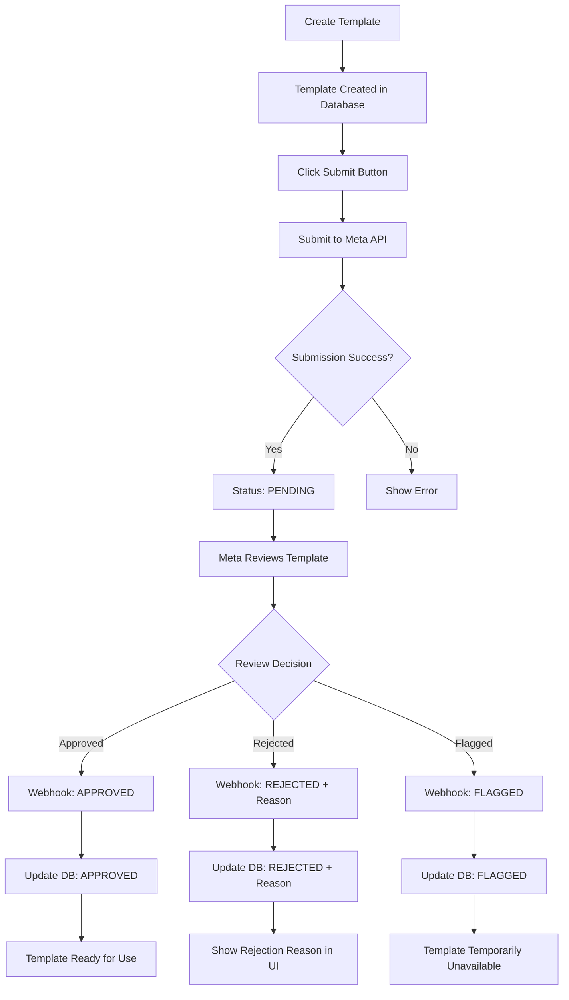

# WhatsApp Template Approval Workflow

## Overview

This document describes the complete template approval workflow implementation for Meta WhatsApp Business API. The system provides end-to-end template management from creation to approval with real-time status updates.

## Features Implemented

### 1. **Template Submission to Meta API**
- ✅ Submit templates to Meta WhatsApp Business API for approval
- ✅ Automatic conversion from internal template format to Meta API format
- ✅ Validation and error handling for submission failures
- ✅ Support for different template categories (AUTHENTICATION, MARKETING, UTILITY)

### 2. **Webhook Status Updates**
- ✅ Real-time webhook processing for template status changes
- ✅ Support for all Meta template statuses:
  - **APPROVED** - Template approved for use
  - **PENDING** - Under review by Meta
  - **REJECTED** - Rejected with reason
  - **FLAGGED** - Flagged for issues
  - **PAUSED** - Temporarily paused
- ✅ Automatic database updates when status changes
- ✅ Activity logging for audit trail

### 3. **Rejection Reason Tracking**
- ✅ Capture and store rejection reasons from Meta
- ✅ Common rejection reasons supported:
  - `ABUSIVE_CONTENT` - Content determined to be abusive
  - `INCORRECT_CATEGORY` - Category incorrect for content
  - `INVALID_FORMAT` - Duplicate content or missing examples
  - `SCAM` - Content determined to be a scam
- ✅ Display rejection reasons in UI for easy troubleshooting

### 4. **Enhanced UI Dashboard**
- ✅ Meta approval status column in templates table
- ✅ Visual status badges with color coding
- ✅ One-click template submission buttons
- ✅ Rejection reason display for failed templates
- ✅ Submission timestamps and approval tracking

## Technical Implementation

### Database Schema Updates

```sql
-- Added fields to WhatsAppTemplate table
metaTemplateStatus    String?    -- Status from Meta (APPROVED, PENDING, REJECTED, etc.)
metaRejectionReason   String?    -- Rejection reason if rejected
metaSubmittedAt       DateTime?  -- When submitted to Meta
metaApprovedAt        DateTime?  -- When approved by Meta
```

### API Endpoints

#### 1. Submit Template for Approval
```typescript
// tRPC endpoint: communication.submitTemplateToMeta
POST /api/trpc/communication.submitTemplateToMeta
{
  "templateId": "template_uuid"
}
```

#### 2. Webhook Handler
```typescript
// Meta webhook endpoint
POST /api/webhooks/meta-whatsapp
// Handles message_template_status_update events
```

### Workflow Process



## Usage Guide

### 1. Creating and Submitting Templates

1. **Create Template**: Use the templates page to create a new WhatsApp template
2. **Review Template**: Ensure content follows Meta's guidelines
3. **Submit for Approval**: Click the "Submit" button in the templates table
4. **Monitor Status**: Watch the "Meta Approval" column for status updates

### 2. Handling Rejections

1. **View Rejection Reason**: Rejected templates show the reason below the status badge
2. **Fix Issues**: Update template content based on rejection reason
3. **Resubmit**: Click "Submit" again after making changes

### 3. Understanding Statuses

| Status | Description | Action Required |
|--------|-------------|-----------------|
| Not Submitted | Template not sent to Meta | Click Submit button |
| PENDING | Under review by Meta | Wait for approval |
| APPROVED | Ready for use | Can send messages |
| REJECTED | Rejected with reason | Fix issues and resubmit |
| FLAGGED | Temporary issue | Monitor for updates |
| PAUSED | Temporarily disabled | Check quality metrics |

## Meta Template Guidelines

To increase approval chances, ensure templates follow Meta's guidelines:

### Content Requirements
- **Be Specific**: Templates should serve a specific business purpose
- **Avoid Marketing Language**: Unless using MARKETING category
- **Include Business Context**: Templates should clearly represent your business
- **Use Proper Variables**: Only include necessary dynamic content

### Category Guidelines
- **AUTHENTICATION**: OTP codes, verification messages
- **UTILITY**: Receipts, status updates, confirmations
- **MARKETING**: Promotional content, offers, newsletters

### Common Rejection Reasons
1. **ABUSIVE_CONTENT**: Avoid aggressive or inappropriate language
2. **INCORRECT_CATEGORY**: Match content to appropriate category
3. **INVALID_FORMAT**: Provide proper examples for variables
4. **SCAM**: Ensure content is legitimate business communication

## Troubleshooting

### Template Submission Fails
- Check Meta WhatsApp API credentials
- Verify Business Account permissions
- Ensure template format is valid

### Webhook Not Received
- Verify webhook URL is accessible
- Check webhook verification token
- Monitor webhook logs for errors

### Status Not Updating
- Check database connection
- Verify webhook handler is processing correctly
- Check communication logs for errors

## Environment Variables

```bash
# Required for template submission
META_WHATSAPP_ACCESS_TOKEN=your_access_token
META_WHATSAPP_BUSINESS_ACCOUNT_ID=your_business_account_id
META_WHATSAPP_WEBHOOK_VERIFY_TOKEN=your_verify_token
```

## Benefits

1. **Automated Workflow**: Reduces manual oversight of template approvals
2. **Real-time Updates**: Immediate notification of approval status changes
3. **Better User Experience**: Clear visibility into approval process
4. **Audit Trail**: Complete history of template submissions and decisions
5. **Error Transparency**: Clear rejection reasons for quick resolution

## Future Enhancements

- [ ] Bulk template submission
- [ ] Template approval analytics dashboard
- [ ] Automated retry for rejected templates
- [ ] Integration with template quality metrics
- [ ] Advanced rejection reason categorization 